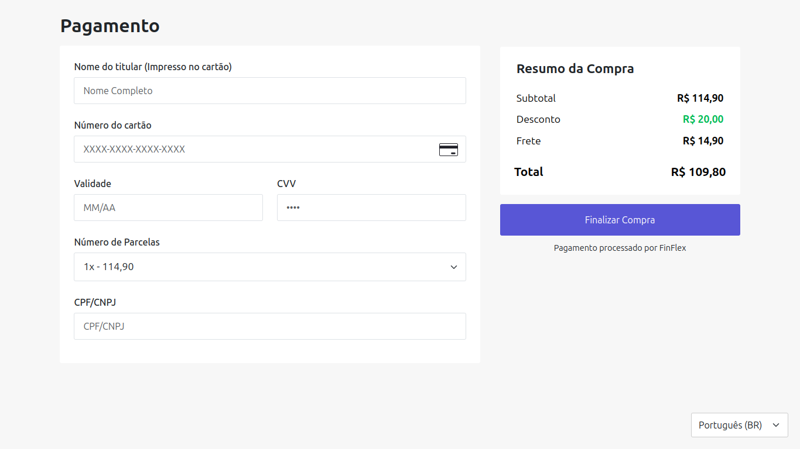

# Angular Checkout Page

## Introdução

Este projeto consiste em uma página de checkout desenvolvida em **Angular**, com integração de formulário reativo para a captura segura de dados de pagamento. A página permite a entrada de informações do cartão, parcelamento e CPF/CNPJ, garantindo validação em tempo real e formatação dinâmica dos campos.

## Funcionalidades

### Formulário de Checkout

- **Entrada de Nome do Titular**: Captura do nome impresso no cartão.
- **Entrada de Número do Cartão**: Campo com formatação automática (XXXX-XXXX-XXXX-XXXX) e detecção de bandeira do cartão.
- **Data de Validade**: Campo formatado para entrada no padrão MM/AA.
- **Código de Segurança (CVV)**: Input numérico validado e formatado corretamente.
- **Parcelamento**: Seleção do número de parcelas disponíveis.
- **CPF/CNPJ**: Entrada formatada e validada conforme o tipo do documento.
- **Validação em Tempo Real**: Feedback imediato sobre formatação e requisitos obrigatórios.

## Estrutura do Projeto

- **src/app/pages/checkout-page/components**: Contém os componentes que compõem a página de checkout.
- **src/app/pages/checkout-page/services**: Contém o serviço responsável pela tradução da aplicação.
- **src/assets/i18n**: Arquivos de tradução do projeto.

## Como Rodar o Projeto

### 1. Instalação das Dependências

Execute o seguinte comando para instalar as dependências do projeto:

```bash
npm install
```

### 2. Inicialização do Servidor de Desenvolvimento

Para iniciar o servidor Angular, execute:

```bash
ng serve
```

A aplicação estará disponível em **http://localhost:4200/**.

### 3. Construção para Produção

Para gerar os arquivos otimizados para produção, utilize:

```bash
ng build --configuration=production
```

## Tecnologias Utilizadas

- **Angular 16.2.0**: Framework principal para desenvolvimento.
- **TypeScript 5.1.3**: Linguagem utilizada no projeto.
- **Bootstrap 5.3.3**: Biblioteca para estilização e responsividade.
- **Bootstrap Icons 1.11.3**: Conjunto de ícones oficiais do Bootstrap.
- **i18n**: Suporte à tradução e internacionalização.

## Autor

Este projeto foi desenvolvido por **Lucas Santos Silva**, Desenvolvedor Full Stack, graduado pela **Escola Técnica do Estado de São Paulo (ETEC)** nos cursos de **Informática (Suporte)** e **Informática para Internet**.

## Licença

Este projeto está licenciado sob a [**Licença MIT**](./LICENSE).

## Imagem do Projeto


